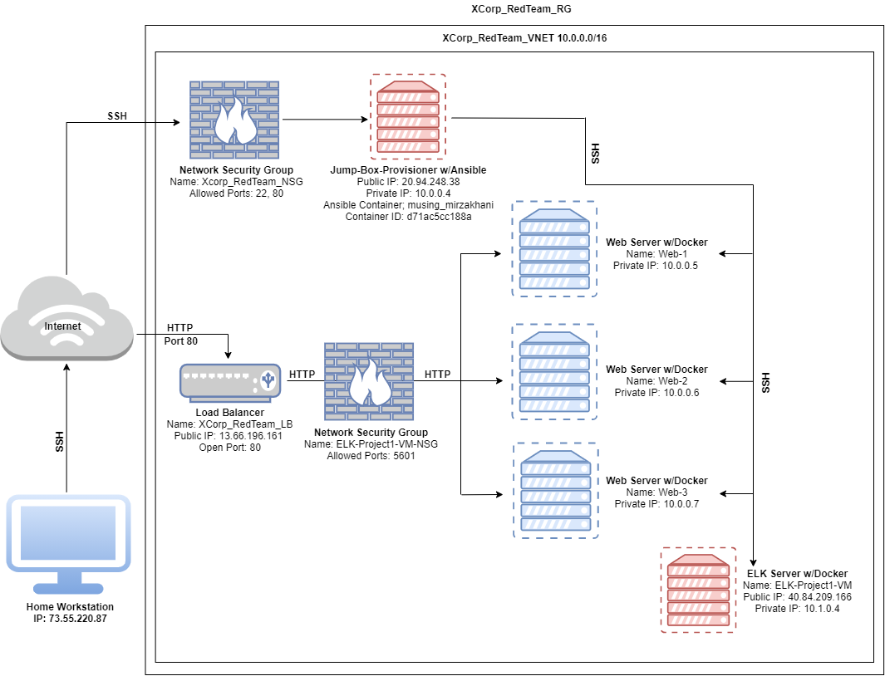

## Automated ELK Stack Deployment

The files in this repository were used to configure the network depicted below.

These files have been tested and used to generate a live ELK deployment on Azure. They can be used to either recreate the entire deployment pictured above. Alternatively, select portions of the _____ file may be used to install only certain pieces of it, such as Filebeat.

  - _TODO: Enter the playbook file._
Ansible Configuration: Ansible.cfg
https://docs.google.com/document/d/1_JlVHMWMvApdcSdrSymNnfapLgNzp9N08NbiXCOUj7w/edit?usp=sharing
Configure ELK VM with Docker
(https://docs.google.com/document/d/1RqOY_Az9MOAsyyBtsq1M6vMZoVjLNkTmi5BSc91rRWw/edit?usp=sharing)
Configure Web VM with Docker
https://docs.google.com/document/d/1zOcchWcWLzCgaxLaXM_f0tTDA7BKBLxLCrM09rDtzDo/edit?usp=sharing
Filebeat Configuration: Filebeat-Config.yml
https://docs.google.com/document/d/1keokmb6tbncIB8cstP8RIrbbPDDjnGh_P6LxwZ466yM/edit?usp=sharing
Metricbeat Configuration: Metricbeat-Config.yml
https://docs.google.com/document/d/1cMJIT6fJ0V1GRa5780F4JTWC_i7X6fQSEnqBxBroPmw/edit?usp=sharing
Installing and Launching Filebeat
https://docs.google.com/document/d/10DQyR9X2XvJCFmRMAJxVhKUOUW3iXcnL1k-r7DC6Ihg/edit?usp=sharing
Install Metric Beat
https://docs.google.com/document/d/1nuavmAXcRc8mHrY3QOpri-FF9Qc-f9oqXKQvKruNm0g/edit?usp=sharing

This document contains the following details:
- Description of the Topology
- Access Policies
- ELK Configuration
  - Beats in Use
  - Machines Being Monitored
- How to Use the Ansible Build

### Description of the Topology

The main purpose of this network is to expose a load-balanced and monitored instance of DVWA, the D*mn Vulnerable Web Application.

Load balancing ensures that the application will be highly AVAILABLE, in addition to restricting ACCESS to the network.
- _TODO: What aspect of security do load balancers protect? What is the advantage of a jump box?_
Load balancers protect the system from DDoS (Denial of Service) attacks. A jumpbox serves as a secure machine (VM) that one can connect to that can be used to manage administrative tasks within a network. A jumpbox adds and extra layer of defense.  

Integrating an ELK server allows users to easily monitor the vulnerable VMs for changes to the _____ and system _____.
- _TODO: What does Filebeat watch for?_ 
- It watches for any changes done on the machine.
- _TODO: What does Metricbeat record?_
- It records metrics from the operating system and from services running on the server(s).

The configuration details of each machine may be found below.
_Note: Use the [Markdown Table Generator](http://www.tablesgenerator.com/markdown_tables) to add/remove values from the table_.

| Name     | Function | IP Address | Operating System |
|----------|----------|------------|------------------|
| Jump Box | Gateway  | 10.0.0.4   | Linux            |
| Web-1 (DVWA)       |    Web Server      |     10.0.0.5       |        Linux          |
| Web-2 (DVWA)         |    Web Server      |     10.0.0.6       |        Linux          |
| Web-3 (DVWA)        |    Web Server      |     10.0.0.7       |        Linux          |  
| ELK-Project1-VM      |    ELK Stack Server     |   10.1.0.4     |        Linux          |        

### Access Policies

The machines on the internal network are not exposed to the public Internet. 

Only the JUMPBOX machine can accept connections from the Internet. Access to this machine is only allowed from the following IP addresses:
- _TODO: Add whitelisted IP addresses_
Home Workstation IP Address 73.55.220.87

Machines within the network can only be accessed by the Jumpbox VM
- _TODO: Which machine did you allow to access your ELK VM? What was its IP address?_
Only the Jumpbox was allowed to access the ELK VM. It's IP is 20.94.248.38 
A summary of the access policies in place can be found in the table below.

| Name     | Publicly Accessible | Allowed IP Addresses |
|----------|---------------------|----------------------|
| Jump Box | NO           | My Own Personal IP  |
|    Web-1      |       NO              |      10.0.0.4                |
|    Web-2      |       NO            |    10.0.0.4                  |
|    Web-3      |       NO            |       10.0.0.4               |
|    Elk-Project1-VM      |      YES           |      10.0.0.4                |

### Elk Configuration

Ansible was used to automate configuration of the ELK machine. No configuration was performed manually, which is advantageous because...
- _TODO: What is the main advantage of automating configuration with Ansible?_
The main advantage would be to save time and be more efficient by being able to automate tasks rather than having to do them manually which can be time consuming. 

The playbook implements the following tasks:
- _TODO: In 3-5 bullets, explain the steps of the ELK installation play. E.g., install Docker; download image; etc._

The ELK Playbook does the following:
- Installs docker.io
 - Installs pip3
 - Installs Docker Python Module
- Increates memory
- Downloads and launches a Docker ELK Container
- Enables service docker on boot

The following screenshot displays the result of running `docker ps` after successfully configuring the ELK instance.

Docker PS Result
https://drive.google.com/file/d/12hXk9Ks7Zjx3-VcEx9TBnPWBe499wTgj/view?usp=sharing

### Target Machines & Beats
This ELK server is configured to monitor the following machines:
- _TODO: List the IP addresses of the machines you are monitoring_

The ELK server is configured to monitor the following servers:
web-1 10.0.0.5
web-2 10.0.0.6
web-3 10.0.0.7 				
				
				
We have installed the following Beats on these machines:
- _TODO: Specify which Beats you successfully installed_
Filebeat and Metricbeat were installed on the following servers:
web-1 10.0.0.5
web-2 10.0.0.6
web-3 10.0.0.7
These Beats allow us to collect the following information from each machine:
- _TODO: In 1-2 sentences, explain what kind of data each beat collects, and provide 1 example of what you expect to see. E.g., `Winlogbeat` collects Windows logs, which we use to track user logon events, etc._
- Filebeat monitors specified logs. It then collects the logs and forwards them to Eliastisearch or Logstash. An example would be 'syslogs'.
- Metricbeat records metrics from systems and services like CPU usage, memory usage, uptime, etc. It takes this information and sends it to an output that the user specifies. An example would be DVWA container - CPU Usage.
 
### Using the Playbook
In order to use the playbook, you will need to have an Ansible control node already configured. Assuming you have such a control node provisioned: 

SSH into the control node and follow the steps below:
- Copy the YAML file to CONTROL NODE.
- Update the HOSTS file to include THE TARGET MACHINES (Web Servers and ELK Server)
- Run the playbook, and navigate to WEBSERVER (VM) to check that the installation worked as expected.

_TODO: Answer the following questions to fill in the blanks:_
- _Which file is the playbook? Where do you copy it?_
filebeat-playbook.yml (copy to) etc/ansible/filebeat-config.yml
- _Which file do you update to make Ansible run the playbook on a specific machine? How do I specify which machine to install the ELK server on versus which to install Filebeat on?_
/etc/ansible/hosts - specify which machines by ensuring you have the correct IP address under the specified servers ex: [elkservers] & [webservers]
- _Which URL do you navigate to in order to check that the ELK server is running?
http://20.97.13.236:5601/app/kibana - replace ip address with public ELK IP address

_As a **Bonus**, provide the specific commands the user will need to run to download the playbook, update the files, etc._

- ansible-playbook /etc/ansible/Install-ELK-Playbook.yml
(installs elk)

- ansible-playbook /etc/ansible/roles/filebeat-playbook.yml
(installs and configures filebeat)

- ansible-playbook /etc/ansible/roles/metricbeat-playbook.yml
(installs and configures metricbeat)
